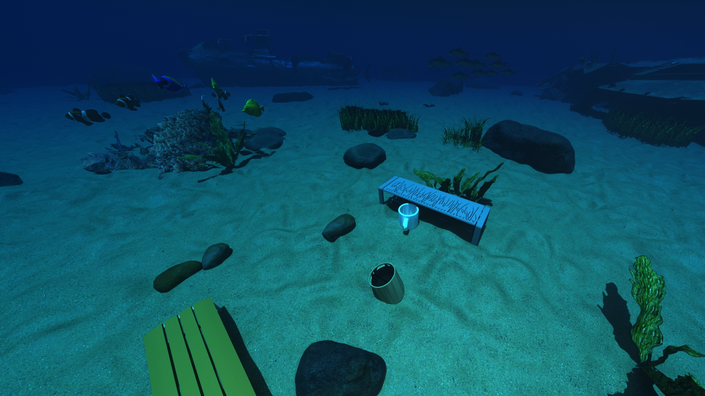
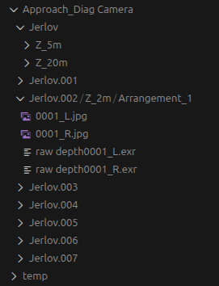

# Simulated-Underwater-Depth-Dataset-Generation

Generation of simulated datasets containing raw RGB and depth of diverse underwater scenes with a stereo camera in Blender. Scenes include realistic seafloor environments and submerged everyday objects. Datasets will be used for training a neural network to recognise depth from an image, which is the basis for underwater grasping. 


| Clear, shallow water | Clear, deep water | Murky, shallow water |
|----------------------|------------------------|-----------------------------|
|  |  |  |


The dataset, in terms of its size and diversity, is highly customisable. The current setup produces a dataset with 260 configurations with 5 camera paths, 4 camera paths, 8 water conditions in 1-2 depths. With 30 rendered frames for each configuration, the complete dataset will be **14.34 GB** and take **10 days, 2 hours** to generate on our tested computer. In total, there would be **7,800** raw RGB and depth pairs. 

The repository and Blender scenes were developed and rendered using Blender 5.0.1 on Ubuntu 24.04, with two NVIDIA GeForce RTX 3080 Ti GPUs.

<!-- VIDEO NOT WORKING?  -->

<!-- | Arc camera path in shallow, clear water |
|------------------------------|
| <video controls src="tutorials\images\arc_demo.mp4" title="Title"></video> |


<video src="tutorials\images\arc_demo.mp4" placeholder="tutorials\images\arc_demo.mp4" autoplay loop controls muted title="Arc Approach Video">
Sorry, your browser doesn't support HTML 5 video.
</video> -->

<!-- <video controls src="arc_demo.mp4" title="Title"></video>  -->
<!-- <video controls src="tutorials\images\arc_demo.mp4" title="Title"></video> -->

 

<!-- ## PLAN
Getting Started
-- Say what ubuntu etc it has been run on, blender version, GPUs
- Pulling Repo 
- Hugging Face 
-- Link Hugging Face (download blender folder then move into here, git ignore won't push it, but need it for relative paths in bash scripts. otherwise change paths in bash script)
- Blender Installation 
-- link cookie tutorial as beginner learning 
- Downloading ShapeNet
-- Has a subset of ShapeNet objects, to add more need to make an account 

Repo Organisation 
-- Link Hugging Face (download blender folder then move into here, git ignore won't push it, but need it for relative paths in bash scripts. otherwise change paths in bash script)
-- Add a scripts folder, fix so folders are pushed but not contents 

Dataset Characteristics 
-- Outputs
-- Features table with time
-- Predicted time and size 

Test with Sample Dataset
- Test scripts, sample dataset -- 1 for each?, a few frames in one
-- Change export path

How to use
- List out tutorials 
- Link additional useful 

Notes for Improvement
-- Include any known issues

Contact
-- Email, LinkedIn
-- Poster 

References
- ShapeNet -->


<!-- 
- Add in Hugging Face (link to)
-- Explain git repo organisation earlier?
- Test scripts
- Script to run after installation to test its working (have to change output export path first?)
- Turn terminal commands into scripts
- Sample dataset
- Reference tutorials and recommended
- scripts configured to read .blend file on my machine, you will need to change the paths to wherever you store the .blend scene after downloading from Hugging Face 
- Also need to change the export paths in files 

CURRENT SETUP: 
Getting Started 
- Pulling Repo
- Blender Installation 
- Learning Blender
Repo Organisation 
Dataset Characteristics
- Outputs
- Features
- Size, Time
How to Use
- (Tutorials)
Known Issues
Notes for Improvement
Contact -->


## Table of Contents

1. [Getting Started](#getting-started)
   - [Pulling the Repository](#pulling-the-repository)
   - [Downloading the Hugging Face Dataset](#downloading-the-hugging-face-dataset)
   - [Blender Installation](#blender-installation)
   - [Downloading ShapeNetCore](#downloading-shapenetcore)
   - [First Steps](#first-steps)

2. [Repository Organisation](#repository-organisation)

3. [Dataset Characteristics](#dataset-characteristics)

4. [Testing with Examples](#testing-with-examples)

5. [How to Use](#how-to-use)

6. [Notes for Improvement](#notes-for-improvement)

7. [Contact](#contact)

8. [References](#references)


## Getting Started 

### Pulling the Repository

In a terminal, navigate to where you want to store the repository. Then pull with: 

```
git clone https://github.com/ollieturner/Simulated-Underwater-Depth-Dataset-Generation.git
```
Then check the pull worked correctly with:
``` 
cd Simulated-Underwater-Depth-Dataset-Generation
git status 
```
Check the repository's contents with `ls` when inside. 


### Downloading the Hugging Face Dataset
The Blender scene, background objects, foreground objects and sample datasets are stored in a Hugging Face dataset due to storage requirements. 

First, if you don't have a Hugging Face account already, make one [here](https://huggingface.co/).

Download the Hugging Face dataset from [here](https://huggingface.co/datasets/owt3/Simulated-Underwater-Depth-Dataset-Generation/tree/main). 

Then move each of the folders into your local version of this repository. This ensures the referenced relative paths operate correctly - in particular, renders call the Blender file in the `blender/` folder. The .gitignore will leave these folders untracked, as they are too big to push to GitHub. 

The expected organisation of the local repository is explained in [Repository Organisation](#repository-organisation).


<!-- 
### Pulling the Hugging Face Dataset
The Blender scene, background objects, foreground objects and sample datasets are stored in a Hugging Face dataset due to storage requirements. 

First, if you don't have a Hugging Face account already, make one [here](https://huggingface.co/).

It is important to run the following whilst inside the repository so the relative paths work correctly. Download the Hugging Face dataset:

```
huggingface-cli login
```
(CHECK IF NEEDED)

```
huggingface-cli download owt3/Simulated-Underwater-Depth-Dataset-Generation --repo-type dataset
```

Make a folder to store the Hugging Face files (not trakced by .gitignore)
```
mkdir -p blender
```
RENAME FOLDER

OR 
```
huggingface-cli download \
  owt3/Simulated-Underwater-Depth-Dataset-Generation \
  --repo-type dataset \
  --local-dir ./ \
  --local-dir-use-symlinks False

```
Then check the download worked correctly with:
```
ls datasets/Simulated-Underwater
```
CHANGE FILE PATHS/NAMES
MAKE IT DOWNLOAD INTO blender/
WILL THIS SAVE ONE FOLDER THEN HAVE IT NESTED IN THERE, CHANGE NAMES TO BE CLEARER?  -->


### Blender Installation

If not installed already, follow the Blender installation instructions [here](https://docs.blender.org/manual/en/latest/getting_started/installing/index.html). 

Any version >= 4.3 is compatible (for the water conditions). Verify version with `blender --version` after installation. 

#### Learning Blender

If you are new to Blender, I recommend following this [tutorial](https://www.youtube.com/watch?v=Ci3Has4L5W4). This will give a general understanding of common controls.  


### Downloading ShapeNetCore
The objects of interest in the foreground are sourced from [ShapeNet](https://shapenet.org/). Select categories of objects are already downloaded and included in the aforementioned Hugging Face dataset. These include benches, couches, bottles, bins, mugs and watercraft. 

If you'd like more ShapeNet objects, make a ShapeNet account and follow their instructions to download ShapeNetCore from their Hugging Face. Note that these two steps require an approval from ShapeNet, so allow a day for each of the approvals. 


### First Steps

I first advise reading the rest of this README to understand the dataset and how to change its contents. 

Once you begin rendering, either from the automated Python scripts or directly from the Blender file, you will need to change the output paths in the Blender file to your local machine. See `tutorials/exporting_blender` for further detail and instructions. 


## Repository Organisation 

<!-- | Folder          | Description                                                                                                     |
|-----------------|-----------------------------------------------------------------------------------------------------------------|
| blender         | Blender files for underwater environments, including scene, objects and sand (from HF)                          |
| demos           | Results to demonstrate scripts, with sub-folders for each script                                                |
| example_sample_dataset | An example sample dataset to compare with (from HF)                                                      |
| results         | Empty folder to that Blender scene outputs into. Its contents are not tracked to avoid pushing large datasets   |
| scripts/blender | Python scripts to run automated Blender processes e.g. generating dataset, rendering images                     |
| scripts/misc    | Other Python scripts e.g. saving a video from rendered images                                                   |
| tutorials       | Guided tutorials on using the Blender scene file e.g. adding cameras and objects                                | -->

| Folder          | Description                                                                                                     |
|-----------------|-----------------------------------------------------------------------------------------------------------------|
| blender         | Blender files for underwater environments, including scene, objects and sand (from HF)                          |
| examples        | Contains example scripts in scripts/ and expected results to compare with in results/                           |
| results         | Empty folder to that Blender scene outputs into. Its contents are not tracked to avoid pushing large datasets   |
| scripts/blender | Python scripts to run automated Blender processes e.g. generating dataset, rendering images                     |
| scripts/misc    | Other Python scripts e.g. saving a video from rendered images                                                   |
| tutorials       | Guided tutorials on using the Blender scene file e.g. adding cameras and objects                                |


Note HF denotes folders from the Hugging Face dataset. They are ignored by the .gitignore and will not be tracked by the repository. 

<!-- Table generated with: https://www.tablesgenerator.com/markdown_tables# -->


## Dataset Characteristics

The **features types and quantities are customisable**. They can be edited either in the Blender scene or the automated Python script (see [Changing the Dataset](#changing-the-dataset)). The current setup (260 configurations) is shown below.  

| **Camera Paths**                                                          | **Camera Types**                                                                                                                                                                       | **Water Conditions**                                                                                                                         | **Depths**                                     | **Random Arrangements** |
|---------------------------------------------------------------------------|----------------------------------------------------------------------------------------------------------------------------------------------------------------------------------------|----------------------------------------------------------------------------------------------------------------------------------------------|------------------------------------------------|-------------------------|
| Approach and retreat<br>Arc <br>Horizontal pan<br>Orbit <br>Top-view pan  | Low focal length (1.3mm), low interocular (INSERT)<br>High focal length (2.2mm), high interocular (INSERT)<br>Low focal length, high interocular<br>High focal length, low interocular | Clear: <br>- Jerlov<br>- Jerlov IA<br>- Jerlov IB<br>- Jerlov II<br>- Jerlov IC<br><br>Murky: <br>- Jerlov III<br>- Jerlov 5C<br>- Jerlov 3C | Clear:<br>- 5m<br>- 20m <br><br>Murky:<br>- 2m | 1 random arrangement    |

The dataset produces raw RGB and depth images (.jpg, .exr respectively). With a left and right camera for the stereo setup, this means one rendered frame of the scene outputs 4 images. 

One rendered frame (4 images) is ~1.8 MB. The time for one render is ~1-2mins - this value varies with each configuration, and mostly depends on water condition and depth (clear/shallow is fast, whilst murky/deep is slow). The resolution is set to 640x480. 

With 30 rendered frames for each configuration, the complete dataset will be **14.34 GB** and take **10 days, 2 hours** to generate. In total, there would be **7,800** raw RGB and depth pairs. 

An example of the folder organisation after the dataset is generated is provided below. Each render is indexed in by its configuration settings. 



Note that this example is for just one camera and one render. However the file organisation extends similarly for successive cameras and renders. 


## Testing with Examples

### Cycling through Configurations

This example will cycle through all the dataset's configurations without rendering any images. 

Each configuration will be printed to the terminal, with no images or folders generated. This will be the same process as when the dataset is generated, as this example simply sets `RENDER = False`. 

From the root in this repo (`cd Simulated-Underwater-Depth-Dataset-Generation`), run `examples/example_print_configs.py` with: 

```
blender -b blender/underwater_scene.blend --python examples/example_print_configs.py
```

You should expect an output like this in the terminal: 

<pre>Blender 5.0.1 (hash a3db93c5b259 built 2025-12-16 01:30:59)
00:01.608  blend            | Read blend: &quot;/home/otur3695/Documents/Simulated-Underwater-Depth-Dataset-Generation/blender/underwater_scene.blend&quot;
DATASET GENERATION FOR SIMULATED UNDERWATER SCENES

---RENDER PROPERTIES---
Rendering enabled: False
Number of frames per configuration: 1
Renders will save into: results/blender_output/
Render resolution: 640 x 480
Resolution percentage: 100%

---DATASET FEATURES---
Available cameras:
  - Approach_Retreat Camera
  - Arc Camera
  - Approach_Diag Camera
  - Orbit Camera
Camera types: 
  Focal lengths: 1.3mm, 2.0mm
  Interocular distances: 0.05mm, 0.07mm
Water conditions:
  - Jerlov I
  - Jerlov IA
  - Jerlov IB
  - Jerlov II
  - Jerlov IC
  - Jerlov III
  - Jerlov 5C
  - Jerlov 3C
Depths (real-world):
  Clear water depths: [5, 20] m
  Murky water depths: [2] m
Object placement:
  Objects per scene: 3–5
  Random arrangements per configuration: 1
  Foreground grid: -1.5 m to 1.5 m (X/Y)

With the current settings, this will take ~10 days, 2 hours to render
and use ~14.34 GB of storage.
Use Ctrl+C to cancel at any time.

Proceed with dataset generation? (y/n): y
Confirmed. Starting dataset generation

Use Ctrl+C to cancel at anytime


=== Camera: Approach_Retreat Camera ===

--- Water condition: Jerlov I (Jerlov) ---
Enabled light: Clear Approach_Retreat Spot
Switched water condition to Jerlov I
Set Ocean Volume Z to: 5 m depth
Random arrangement 1
Set Ocean Volume Z to: 20 m depth
Random arrangement 1</pre>


This is a useful troubleshooting step to run to check the configurations are loading correctly, instead of rendering and reaching potential issues after hours/days. 


### Generating Example Dataset 

Now to finally render images! This example will render two example configurations with 30 frames each. It is currently set to render one scene in shallow, clear water, and another in shallow, murky water.

If this is your first time rendering underwater_scene.blend then you need to **change the output paths before continuing**. Otherwise you'll hit errors. See `tutorials/exporting_blender` for further detail and instructions.

From the root of this repo (`cd Simulated-Underwater-Depth-Dataset-Generation`), run `scripts/examples/example_generate_dataset.py` with: 

```
blender -b blender/underwater_scene.blend --python examples/example_generate_dataset.py
```

You should expect scenes that resemble this: 

| Clear, shallow water | Murky, shallow water |
|----------------------|-----------------------------------------------------|
| INSERT PHOTO | INSERT PHOTO |

Feel free to change the features used in the script `examples/example_generate_dataset`. This may be a useful troubleshooting step to check particular configurations without rendering a complete dataset. 


## How to Use 
The following sections detail how to generate and change the dataset, with tutorials from `tutorials` referenced as needed. 

Other useful tutorials in `tutorials/` involve rendering a single image/animation of the current Blender scene, converting rendered images into a video and checking the depth from .exr files. 

As stated previously, please change the output path for the renders if this is your first time using underwater_scene.blend on a new machine. See `tutorials/exporting_blender` for further detail and instructions.


<!-- - Configure output path
- Generate dataset
- Edit/Add features (table)
- Render single/animation of current scene
- Convert images into video (stereo/single view)
- Check depth 
 -->


<!-- table for how to add/edit each feature, say either in Blender or in python script  -->


### Generate the Dataset

Run the following to generate the dataset. This process is predicted to use 14.34 GB of storage, and take ~10 days, 2 hours on our machine (time will vary with different computers/GPUs). 

```
cd Simulated-Underwater-Depth-Dataset-Generation

blender -b blender/underwater_scene.blend --python scripts/blender/generate_dataset.py
```

The number of frames per configuration is 30. This may be changed in `blender/generate_dataset.py` with the `scene.frame_end` variable. 

The features used can be customised (edited, added, removed). See the next section. 


### Changing the Dataset


| Feature            | How To Customise                                                                                                                                                                                                                                                                                          |
|--------------------|-----------------------------------------------------------------------------------------------------------------------------------------------------------------------------------------------------------------------------------------------------------------------------------------------------------|
| Camera path    | Follow `tutorials/adding_camera_and_water` for adding camera (and accompanying spotlight).                                                                                                                                                                                                                 |
| Camera type        | Blender:<br>- In object settings with camera selected.<br>Python: <br>- Change focal lengths and interocular distances used with INSERT                                                                                                                                                                   |
| Water condition    | Blender: <br>- Shader Editor of Ocean Volume object. Link the nodes as shown. (For visualising changes when editing scene) <br>Python: <br>- Change the water conditions used with in `WATER_CONDITIONS` list. (For changing dataset)<br><br>See `tutorials/adding_camera_and_water` for more information |
| Depth              | Blender:<br>- Z height for Ocean Volume object (offset of -25m in Blender = 0 depth) <br>Python: <br>- Change the depths used for clear and murky water in `CLEAR_DEPTHS` and `MURKY_DEPTHS` lists in Python                                                                                                                                     |
| Random arrangement | Python:<br>- Change number of arrangements with `NUM_RANDOM_ARRANGEMENTS` variable in Python.<br>- Change the number of possible objects with `MIN_OBJECTS`, `MAX_OBJECTS`<br>- Collision avoidance is achieved with Axis-Aligned Bounding Box method in INSERT function.                                 |
| Objects            | Follow `tutorials/importing_objects` for adding background and foreground objects.                                                                                                                                                                                                                        |


<!-- ### Render Single Animation/Image -->


<!-- emphasis single animation  -->

<!-- - provide script or just set num of frames to 1 -->
<!-- emphasis single animation  -->


<!-- ### Converting Images to Video -->
<!-- useful for visualising camera trajectories empirically/qualitatively  -->

<!-- single view
stereo 
(different files or make option in the same file?) -->

<!-- ### Check Depth 

PUT INTO TUTORIAL

To check that the depth .exr files are returning sensible values

python3 scripts/misc/check_depth.py -->


## Notes for Improvement

Currently a subset of everyday ShapeNet objects have been manually selected, imported and organised into collections that are iterated over. This object import could be automated in the dataset generation script, where objects stored in the ShapeNet folder are called on each iteration. 


Further work could be done on determining if it is possible to change the output render path for exports from the Compositing nodes. From my research I wasn't able to find a method that worked. This would ease the onboarding process if it is possible. 

## Contact: 
Oliver Turner (Undergraduate student at USYD, finishing Sem 2 2026)

Email: <otur3695@uni.sydney.edu.au>

LinkedIn: [here](www.linkedin.com/in/oliver-turner-635254291)


## References

A. X. Chang, T. Funkhouser, L. Guibas, P. Hanrahan,
Q. Huang, Z. Li, S. Savarese, M. Savva, S. Song, H. Su,
J. Xiao, L. Yi, and F. Yu. ShapeNet: An Information-Rich
3D Model Repository. Technical Report arXiv:1512.03012
[cs.GR], Stanford University — Princeton University —
Toyota Technological Institute at Chicago, 2015.
