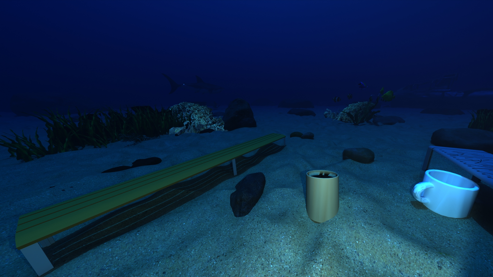
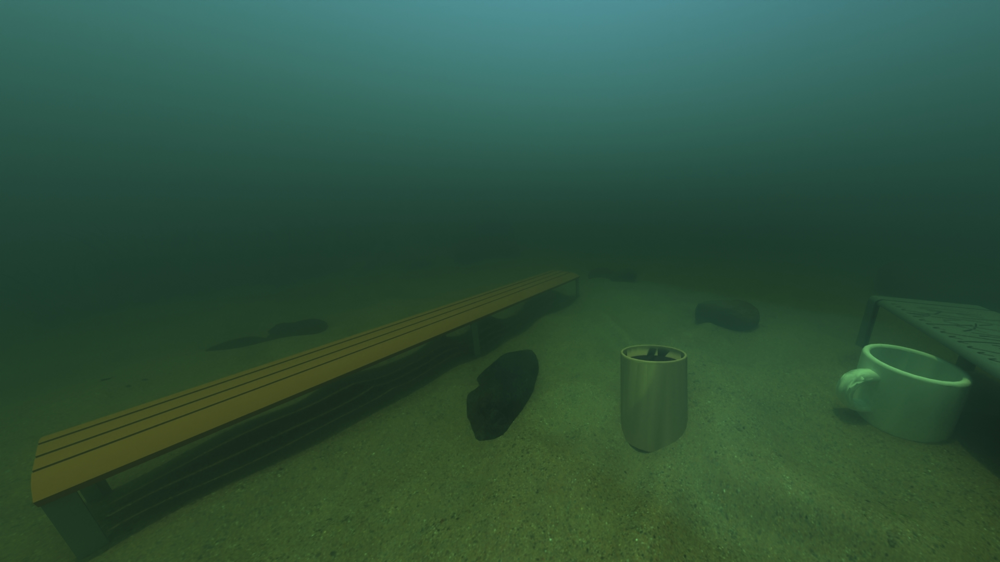
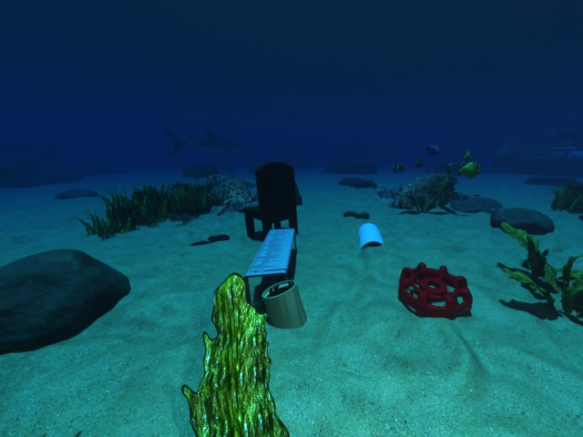
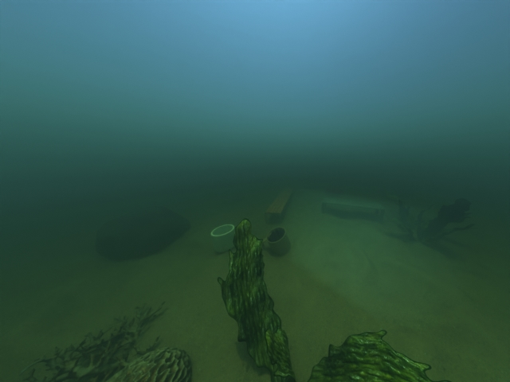

# SeaStereo-Generation

Generation of SeaStereo dataset containing raw RGB and depth images of diverse underwater scenes with a stereo camera in Blender. Scenes include realistic seafloor environments and submerged everyday objects. Dataset will be used to evaluate stereo vision methods in underwater settings. 

The rendered datset and Blender scene is stored on Hugging face [here](https://huggingface.co/datasets/SeaStereo-USYD/SeaStereo-Dataset). This repo covers the dataset generation and customisation.


| Clear, shallow water | Clear, deep water | Turbid, shallow water |
|----|----|----|
|   |   |   |


The dataset, in terms of its size and diversity, is **customisable**. The current setup produces a dataset with 1176 configurations with 7 camera paths, 4 camera types, 7 water conditions, 1-2 depths and 3 random arranegments of objects. With 40 rendered frames for each configuration, there will be **40,320** raw RGB and depth pairs. SeaStereo is **70.2 GB**.

The repository and Blender scenes were developed and rendered using Blender 5.0.1 on Ubuntu 24.04, with two NVIDIA GeForce RTX 3080 Ti GPUs. It took **11.7 days** to generate on our machine. 


## Table of Contents

1. [Dataset Characteristics](#dataset-characteristics)
2. [Repository Organisation](#repository-organisation)
3. [Getting Started](#getting-started)
   * [Pulling the Repository](#pulling-the-repository)
   * [Downloading the Blender Scene from Hugging Face](#downloading-the-blender-scene-from-hugging-face)
   * [Blender Installation](#blender-installation)
   * [Updating Output Path](#updating-output-path)
4. [How to Use](#how-to-use)
   * [Generate the Dataset](#generate-the-dataset)
   * [Changing the Dataset](#changing-the-dataset)
5. [Contact](#contact)
6. [Notes for Improvement](#notes-for-improvement)
7. [To Do](#to-do)
8. [References](#references)

## Dataset Characteristics

The **features types and quantities are customisable**. The current setup (1176 configurations) is shown below.

| **Camera Paths** | **Camera Types** | **Water Conditions** | **Depths** | **Objects** |
|----|----|----|----|----|
| Approach and retreat 1<br> Approach and retreat 2<br> Arc <br>Horizontal pan 1<br> Horizontal pan 2<br> Orbit <br>Top-view pan | Low focal length (1.5mm), low interocular (0.04mm)<br>High focal length (2.5mm), high interocular (0.08mm)<br>Low focal length, high interocular<br>High focal length, low interocular | Clear: <br>• Jerlov<br>• Jerlov IA<br>• Jerlov IB<br>• Jerlov II<br>• Jerlov IC<br><br>Turbid: <br>• Jerlov III<br>• Jerlov 3C | Clear:<br>• 5-10m<br>• 15-20m <br><br>Murky:<br>• 1.7-2.3m | 3 random selection and arrangements of 3-5 objects |

A camera path is followed for 40 frames. The camera type (focal length, interocular distance), water condition, depth (a random value within the above ranges) and objects are set for each 40 frame configuration.

The dataset produces raw RGB and depth images (.jpg, .exr respectively). With a left and right camera for the stereo setup, this means one rendered frame of the scene outputs 4 images. One rendered frame (4 images) is \~1.8 MB. The resolution is set to 640x480.

With an image width of 640 pixels and sensor width of 6.7mm, the low and high focal lengths may also be expressed as 143 and 239 pixel units, respectively.


## Repository Organisation


| Folder | Description |
|----|----|
| blender_scene | Untracked folder to contain Blender scene from Hugging Face |
| examples | Contains scripts and expected results for tutorial examples |
| results | Untracked folder where dataset is rendered into|
| scripts/blender | Python scripts to run automated Blender processes e.g. generating dataset, rendering images |
| scripts/misc | Other Python scripts e.g. saving a video from rendered images |
| tutorials | Guided tutorials on using the Blender scene file e.g. adding cameras and objects |


## Getting Started

### Pulling the Repository

In a terminal, navigate to where you want to store the repository. Then pull with:

```
git clone https://github.com/ollieturner/SeaStereo-Generation.git
```

Then check the pull worked correctly with:

``` 
cd SeaStereo-Generation
git status 
```

Check the repository's contents with `ls` when inside.


### Downloading the Blender Scene from Hugging Face

The SeaStereo dataset is generated from a Blender scene. Due to storage requirements, this file is stored on Hugging Face [here](https://huggingface.co/datasets/SeaStereo-USYD/SeaStereo-Dataset). 

Download `underwater_scene.blend` and move it into the `blender_scene/` folder (the .gitignore will ignore this folder's contents).


### Blender Installation

If not installed already, follow the Blender installation instructions [here](https://docs.blender.org/manual/en/latest/getting_started/installing/index.html).

Any version >= 4.3 is compatible (for the water conditions). Verify version with `blender --version` after installation.

If you are new to Blender, I'd recommend following this [tutorial](https://www.youtube.com/watch?v=Ci3Has4L5W4). This will give a general understanding of common controls.


### Updating Output Path

Change the output paths in the Blender file to your local machine. See `tutorials/exporting_blender` for further detail and instructions.


## How to Use

The following sections detail how to generate and change the dataset, with tutorials referenced as needed.

### Generate the Dataset

Run the following to generate the SeaStereo dataset. 

```
cd SeaStereo-Generation

nohup blender -b blender_scene/underwater_scene.blend --python scripts/blender/generate_dataset.py > output.log 2>&1 &
```

Some useful debug functionality in `scripts/blender/generate_dataset.py`: 
- Set `RENDER` to False. The program will cycle through all the configurations and print the settings, without rendering any images. Because this is a quick process, it is useful to ensure configuration settings are applied correctly.
- Reduce `frame_end` to 1. Originally 40 for the complete dataset, this can be reduced to quickly render example images across different configurations to ensure the program is operating correctly.
- Run `blender -b blender_scene/underwater_scene.blend --python scripts/blender/generate_dataset.py` instead to see the messages print live to the terminal (rather than saved to output.log file).


### Changing the Dataset

The dataset features may be customised by editing the scene in Blender or the Python script `scripts/blender/generate_dataset.py`. Where suitable, tutorials are referenced below. 

| Feature | How To Customise |
|----|----|
| Camera path | Follow `tutorials/adding_camera_and_water` for adding camera (and accompanying spotlight). |
| Camera type settings | Blender:<br>• In object settings with camera selected <br>Python: <br>• Change focal lengths and interocular distances with `FOCAL_LENGTHS` and `INTEROCULAR_DIST` |
| Water condition | Blender: <br>• Shader Editor of Ocean Volume object <br>Python: <br>• Select the water conditions used in the `WATER_CONDITIONS` list <br><br>See `tutorials/adding_camera_and_water` for more information |
| Depth | Blender:<br>• Z height for Ocean Volume object <br>Python: <br>• Change the depth ranges in `MURKY_SHALLOW_RANGE`, `CLEAR_DEEP_RANGE`, `CLEAR_SHALLOW_RANGE` |
| Random arrangement | Python:<br>• Change number of arrangements with `NUM_RANDOM_ARRANGEMENTS` variable <br>• Change the number of possible objects with `MIN_OBJECTS`, `MAX_OBJECTS`<br>• Collision avoidance is achieved with Axis-Aligned Bounding Box method in `rand_arrange_objects()` function |
| Objects | Follow `tutorials/importing_objects` for adding background and foreground objects |


## Contact:

Oliver Turner (Undergraduate student at USYD, finishing Sem 2 2026)

Email: [otur3695@uni.sydney.edu.au](mailto:otur3695@uni.sydney.edu.au)

LinkedIn: [here](www.linkedin.com/in/oliver-turner-635254291)


## Notes for Improvement

Currently, a subset of everyday ShapeNet objects have been manually selected, imported and organised into collections that are iterated over. Attempts to automate this selection and import in Python were unsuccessful - if successful, then the complete breadth of the ShapeNet dataset can be used.

Attempts to automate the output render path for exports from the Compositing nodes were unsuccessful. If this can be completed, then it would ease the onboarding process for new users. 

Marine snow is currently disabled, however the object is in the Ocean Collection in the Blender scene and can be enabled for render if desired.

## To Do
Check over `tutorials/`.
Check over `examples/`.

## References

A. X. Chang, T. Funkhouser, L. Guibas, P. Hanrahan,
Q. Huang, Z. Li, S. Savarese, M. Savva, S. Song, H. Su,
J. Xiao, L. Yi, and F. Yu. ShapeNet: An Information-Rich
3D Model Repository. Technical Report arXiv:1512.03012
\[cs.GR\], Stanford University — Princeton University —
Toyota Technological Institute at Chicago, 2015.


<!-- 


# UP TO HERE

put dataset charctaeristics first, then repo organisation, then getting started

then examples
- update example dataset script
- make links to tutorials/md's in examples folder
(put into how to use and reference mds)

then how to use/how to generate dataset
how to customise dataset/how to use
- links to tutorials folder
(two different sections)

improvement

contact etc 

update table of contents


### Downloading ShapeNetCore

The objects of interest in the foreground are sourced from [ShapeNet](https://shapenet.org/). Selected objects (benches, couches, chairs and mugs) are already included with Pack Resources applied.

If you'd like more ShapeNet objects, make a ShapeNet account and follow their instructions to download ShapeNetCore from their Hugging Face. Note that these two steps require an approval from ShapeNet, so allow a day for each of the approvals. See `tutorials/importing_objects` for further detail on adding objects.


### First Steps

I first advise reading the rest of this README to understand the dataset and how to change its contents.

Once you begin rendering, either from the automated Python scripts or directly from the Blender file, you will need to change the output paths in the Blender file to your local machine. See `tutorials/exporting_blender` for further detail and instructions.


## Testing with Examples

### Cycling through Configurations

This example will cycle through all the dataset's configurations without rendering any images.

Each configuration will be printed to the terminal, with no images or folders generated. This will be the same process as when the dataset is generated, as this example simply sets `RENDER = False`.

From the root of this repo (`cd Simulated-Underwater-Depth-Dataset-Generation`), run `examples/example_print_configs.py` with:

```
blender -b blender_scene/underwater_scene.blend --python examples/example_print_configs.py
```

You should expect an output like this in the terminal:

<pre>Blender 5.0.1 (hash a3db93c5b259 built 2025-12-16 01:30:59)
00:01.549  blend            | Read blend: "/home/otur3695/Documents/Simulated-Underwater-Depth-Dataset-Generation/blender_scene/underwater_scene.blend"
DATASET GENERATION FOR SIMULATED UNDERWATER SCENES

\---RENDER PROPERTIES---
Rendering enabled: False
Number of frames per configuration: 1
Renders will save into: results/blender_output/
Render resolution: 640 x 480
Resolution percentage: 100%

\---DATASET FEATURES---
Available cameras:

* Approach_Retreat Camera
* Arc Camera
* Orbit Camera
* Horizontal_Pan Camera
* Top_View_Pan Camera
  Camera types:
  Focal lengths: 1.5mm, 2.5mm
  Interocular distances: 0.04mm, 0.08mm
  Water conditions:
* Jerlov I
* Jerlov IA
* Jerlov IB
* Jerlov II
* Jerlov IC
* Jerlov III
* Jerlov 5C
* Jerlov 3C
  Depths (real-world):
  Clear water depths: \[5, 20\] m
  Murky water depths: \[2\] m
  Object placement:
  Objects per scene: 3–5
  Random arrangements per configuration: 1
  Foreground grid: -1.5 m to 1.5 m (X/Y)

With the current settings, this will take \~10 days, 2 hours to render
and use \~14.34 GB of storage.
Use Ctrl+C to cancel at any time.

Proceed with dataset generation? (y/n): y
Confirmed. Starting dataset generation

Use Ctrl+C to cancel at anytime


Render with:
Approach_Retreat Camera
Focal length: 1.5mm
Interocular distance: 0.04mm
Enabled light: Clear Approach_Retreat Spot
Water condition: Jerlov I (Jerlov)
Ocean volume depth: 5 m
Random arrangement: 1
</pre>


This is a useful troubleshooting step to run to check the configurations are loading correctly, instead of rendering and reaching potential issues after hours/days.


### Generating Example Dataset

Now to finally render images! This example will render two example configurations with 30 frames each. It is currently set to render one scene in shallow, clear water, and another in shallow, murky water.

If this is your first time rendering underwater_scene.blend then you need to **change the output paths before continuing**. Otherwise you'll hit errors. See `tutorials/exporting_blender` for further detail and instructions.

From the root of this repo (`cd Simulated-Underwater-Depth-Dataset-Generation`), run `scripts/examples/example_generate_dataset.py` with:

```
blender -b blender_scene/underwater_scene.blend --python examples/example_generate_dataset.py
```

An example dataset with only 1 rendered frame per configuration is provided in `examples/eample_dataset`. You should expect scenes that resemble this:

| Clear, shallow water | Murky, shallow water |
|----|----|
|   |   |


Feel free to change the features used in the script `examples/example_generate_dataset`. This may be a useful troubleshooting step to check particular configurations without rendering a complete dataset.


## How to Use

The following sections detail how to generate and change the dataset, with tutorials referenced as needed.

Other useful tutorials in `tutorials/` involve rendering a single image/animation of the current Blender scene, converting rendered images into a video and checking the depth from .exr files.

As stated previously, please change the output path for the renders if this is your first time using underwater_scene.blend on a new machine. See `tutorials/exporting_blender` for further detail and instructions.


### Generate the Dataset

Run the following to generate the dataset. This process is predicted to use 14.34 GB of storage, and take \~10 days, 2 hours on our machine (time will vary with different computers/GPUs).

```
cd Simulated-Underwater-Depth-Dataset-Generation

blender -b blender_scene/underwater_scene.blend --python scripts/blender/generate_dataset.py
```

The number of frames per configuration is 30. This may be changed in `blender/generate_dataset.py` with the `frame_end` variable.

The features used can be customised (edited, added, removed). See the next section.


### Changing the Dataset


| Feature | How To Customise |
|----|----|
| Camera path | Follow `tutorials/adding_camera_and_water` for adding camera (and accompanying spotlight). |
| Camera type | Blender:<br>- In object settings with camera selected.<br>Python: <br>- Change focal lengths and interocular distances used with `FOCAL_LENGTHS` and `INTEROCULAR_DIST` |
| Water condition | Blender: <br>- Shader Editor of Ocean Volume object. Link the nodes as shown. (For visualising changes when editing scene) <br>Python: <br>- Change the water conditions used in `WATER_CONDITIONS` list. (For changing dataset)<br><br>See `tutorials/adding_camera_and_water` for more information |
| Depth | Blender:<br>- Z height for Ocean Volume object (offset of -25m in Blender = 0 depth) <br>Python: <br>- Change the depths used for clear and murky water in `CLEAR_Z_OFFSETS` and `MURKY_Z_OFFSETS` lists in Python |
| Random arrangement | Python:<br>- Change number of arrangements with `NUM_RANDOM_ARRANGEMENTS` variable in Python.<br>- Change the number of possible objects with `MIN_OBJECTS`, `MAX_OBJECTS`<br>- Collision avoidance is achieved with Axis-Aligned Bounding Box method in rand_arrange_objects() function. |
| Objects | Follow `tutorials/importing_objects` for adding background and foreground objects. |

## Notes for Improvement

Currently a subset of everyday ShapeNet objects have been manually selected, imported and organised into collections that are iterated over. This object import could be automated in the dataset generation script, where objects stored in the ShapeNet folder are called on each iteration.

Further work could be done on determining if it is possible to change the output render path for exports from the Compositing nodes. From my research I wasn't able to find a method that worked. This would ease the onboarding process if it is possible.

Marine snow is currently disabled, however the object is in the Ocean Collection in the Blender scene and can be enabled for render.

Underwater caustic lighting may be added. There are a number of video tutorials that can guide you through this.

## Contact:

Oliver Turner (Undergraduate student at USYD, finishing Sem 2 2026)

Email: [otur3695@uni.sydney.edu.au](mailto:otur3695@uni.sydney.edu.au)

LinkedIn: [here](www.linkedin.com/in/oliver-turner-635254291)


## References

A. X. Chang, T. Funkhouser, L. Guibas, P. Hanrahan,
Q. Huang, Z. Li, S. Savarese, M. Savva, S. Song, H. Su,
J. Xiao, L. Yi, and F. Yu. ShapeNet: An Information-Rich
3D Model Repository. Technical Report arXiv:1512.03012
\[cs.GR\], Stanford University — Princeton University —
Toyota Technological Institute at Chicago, 2015. -->