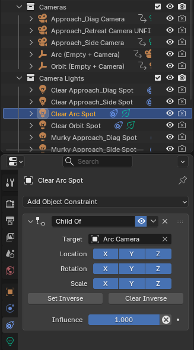

Copy existing camera, move into collection
setting start position, then move and set keyframes
- can also lock view and move from their (see cookie tutorial) (suggest doing cookie tutorial first) 
then copy camera spotlight
delete camera that's with it
make child of the correct camera
explain naming convention
then add into automated script --> no don't need to, just ensure same name except spot/camera swaps

google for particular movements, like orbiting was from video tutorial toget a smooth orbit

photos: 
- lock view perspective (N, then toggle padlock) 

- photo of collections

- then photo of making it child of 

