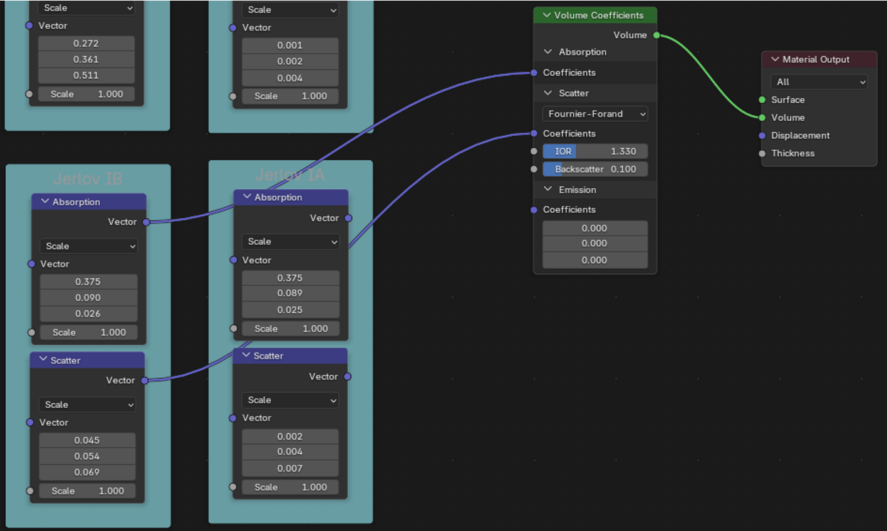
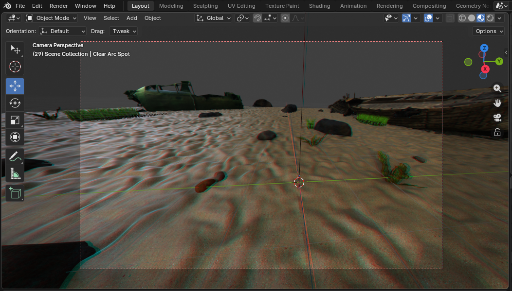

# TUTORIAL

## Adding a Camera in Blender and Water Conditions

### Aim
To add a new camera (with spotlight) into the Blender scene. Also explains the water conditions, as this is necessary to pair the correct spotlight with the environment.

### Background

Renders in Blender are exported from the perspective of a camera. The camera can be configured to follow a path over a number of frames e.g. circle, approach or arc. This diversity is necessary for an effective dataset. 

The cameras are also accompanied by a light. This light is placed just to the right and slightly behind the camera. The light is particularly useful in dark conditions/lower depths. 

In clear water conditions, a bright, wide beam spotlight is used.

The same beam cannot be used in murky conditions, as the light is washed out, or appears as a big flash, due to backscattering. Instead, as used in real dives in murky conditions, a narrow, high intensity beam is used (from [here](https://incredibleunderwaterlights.com/best-underwater-dock-lights-for-clear-vs-murky-water-whats-the-difference/?srsltid=AfmBOoobJ9waNBRJKu1PwbfEWVRJJk9xkTmqYbTxg4dH-j033j7o1NfY)). This relies on the camera movement for different parts of the scene to get illuminated. 

The water conditions are distinguished by their volume coefficients, which control the extent to which light is *Absorbed* and *Scattered*. They are accessed by viewing the Shader Editor with the Ocean Volume selected. Alexandre Cardaillac at ACFR developed these water conditions.

### Initial Configuration

#### Cameras and Lights

The current setup organises cameras and spotlights into two collections - Cameras and Camera Lights. Open `blender_scene/underwater_scene.blend` to view this. 

Take note of the naming convention - follow this same pattern so the automated dataset generation scripts can correctly identify the cameras and the corresponding lights. Use the same name to pair spotlights with the correct camera.

- Cameras: \<NAME\> Camera
- Clear Spotlight: Clear \<NAME\> Spot
- Murky Spotlight: Murky \<NAME\> Spot

The Clear spotlight was based on Blender's suggested settings for a car headlight ([here](https://docs.blender.org/manual/en/latest/render/lights/light_object.html)), whilst the Murky spotlight was achieved after experimentation with a narrow, intense beam. The settings can be seen in the light's object settings when the light is selected. 

#### Water Conditions

This is the organisation of the water conditions into clear and murky. Intuitively, the Clear spotlights are used in the clear water conditions, and the Murky spotlights in the murky water conditions. This may be changed in the dataset generation scripts by editing the CLEAR_WATER_FRAMES and MURKY_WATER_FRAMES lists. 

| Spotlight    | Frame ID     | Jerlov Type | Notes |
|--------------|--------------|-------------|-------|
| Clear        | Jerlov       | Jerlov I    | Very clear |
| Clear        | Jerlov.001   | Jerlov IA   | Very clear |
| Clear        | Jerlov.005   | Jerlov IB   | Very clear |
| Clear        | Jerlov.004   | Jerlov II   | Clear |
| Clear        | Jerlov.003   | Jerlov IC   | Slightly murky but still clear |
| Murky        | Jerlov.002   | Jerlov III  | Murky |
| Murky        | Jerlov.007   | Jerlov 5C   | Murky |
| Murky        | Jerlov.006   | Jerlov 3C   | Murky |

A couple of water conditions (Jerlov 7C and Jerlov 9C) are not used at all since they too murky (they are still present in the Shader Editor). The murky water conditions are only used for shallow depths (<5m), as it becomes too dark any further. Clear water conditions are used at all depths. 

### Instructions

Select a camera in the Cameras collection, then copy and paste a new version. Rename it as \<NAME\> Camera with a descriptive name for the camera path. 

Then in the Camera Lights collection, select an existing Clear spotlight. Copy, paste, rename and delete the new camera that pops up with it. With the spotlight selected, navigate to Constraints and select the camera as Target (see photo below).

This will make the light the child of the camera, so it will move with the camera. Since it is copying existing spotlights, it will move to the same, pre-configured position (just to the right and back of the camera). Repeat for the Murky spotlight.

To animate particular camera movements/paths, insert keyframes in the Timeline menu when the camera is at different positions. Follow the [cookie tutorial](https://www.youtube.com/watch?v=Ci3Has4L5W4) in the Learning Blender section of the repo README. For more complicated movements, like an orbit, research for video tutorials - there are lots for anything you want to do!

A useful tip is viewing the scene from the camera's perspective. Then by locking the perspective, the camera will move as you move in this frame (be sure to unlock when finished). 

| Camera View | Camera View (Locked) |
|------------------------------|----------------------------------|
|  |  |
| Access by pressing the camera icon | Lock/Unlock with padlock icon. Note the second dotted red outline |

### Testing Camera and Lights

The easiest and quickest way to verify a camera path is in the Blender scene. Press play in the Timeline menu to watch the cameras move. It may be helpful to disable other cameras from the viewport. Watch the camera move either from the standard, outside perspective, or by pressing the camera icon to watch from the camera's point of view. 

To verify the lights are correct, render a single frame by pressing F12. The render window will show up, and the renders are saved to the saved export filepath. 

A typical mistake (I made a few times) was leaving a few lights visible then rendering. Ensure the spotlight of interest is the **only** one enabled for render.

