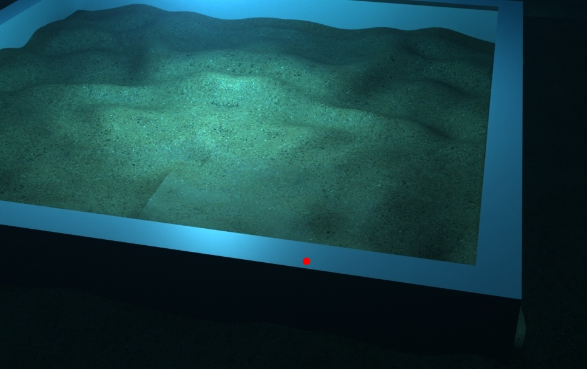

# TUTORIAL

## Check Depth

### Aim
This tutorial explains how to roughly check that the raw depth .exr files are outputting sensible depth values. 


### Background
The dataset integrity is reliant on appropriate depth values being outputted with the accompanying RGB image in order to train the neural network. 

The rough check of depth will be conducted by comparing the depth in the .exr files with the depth measured directly in the Blender scene. 


### Instructions

#### Check Depth in Blender

Use the Measurement tool on the left panel to measure the distances between two objects. Select the camera and an object in frame - hold Ctrl whilst trying to select the object, it will help lock onto the surface rather than a free point in space. 


#### Check Depth of .exr in Python 

The python script used is `check_depth.py` in `scripts/misc`. 

Copy a rendered frame from a dataset or render a single frame from `render_animation.py` or `render_image.py`. Move the raw RGB and depth files into `examples/check_depth_io/input/`. You may choose a different location, but then make sure to change the file paths for the `raw_depth_path` and `raw_image_path` variables.

This script will read in the .exr file and output the depth for a query pixel inputted into the variable `check_pixel`. It will mark the query pixel with a red circle on the raw image and save that that image into `examples/check_depth_io/output/`.

Run the python script from the root of the repo with: 

```
python3 scripts/misc/check_depth.py
```

You should expect an output like this in terminal: 

```
Depth at pixel (505, 430) from raw EXR depth: 1.8313612937927246m
Saved annotated raw image to: examples/check_depth_io/output/raw_image_with_marker.jpg
```

And the output image with the red circle marking the query pixel saved to `examples/check_depth_io/output/`:



