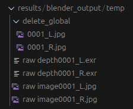
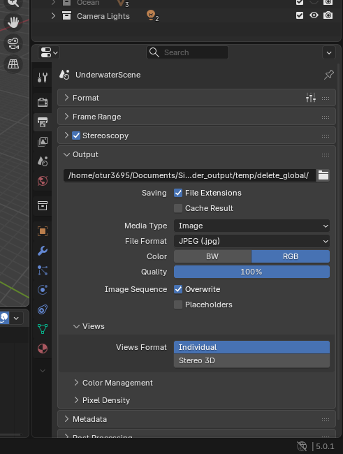
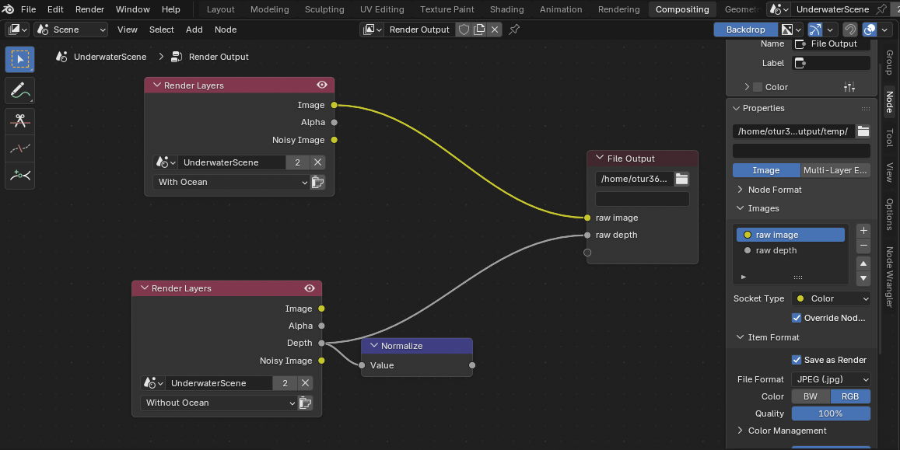
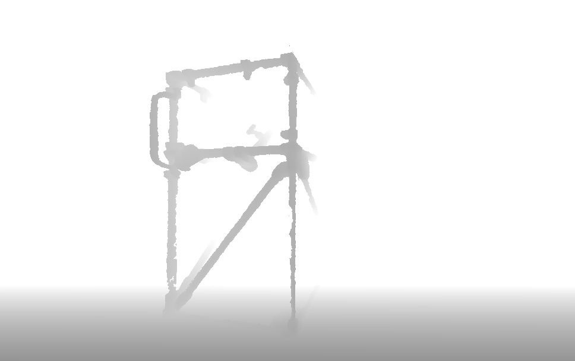
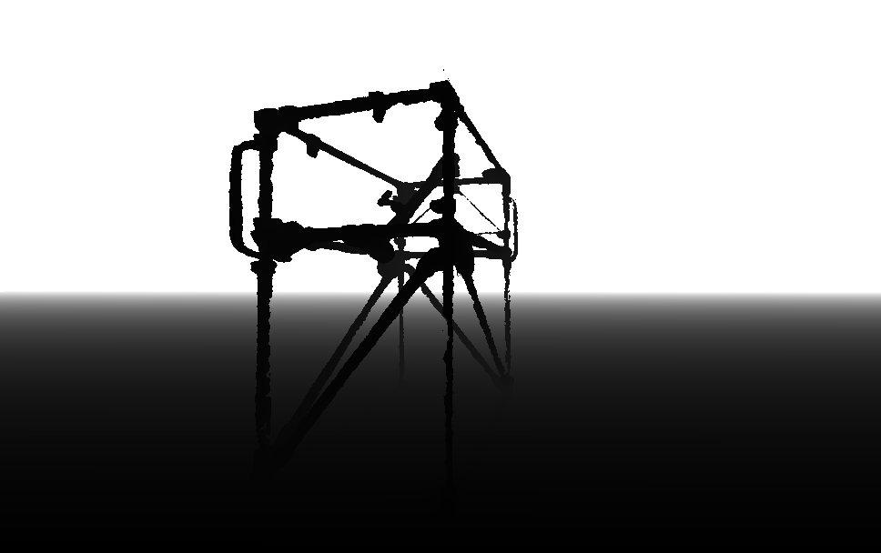
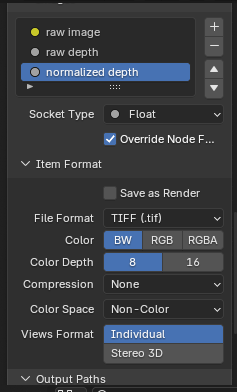

# TUTORIAL

## Exporting in Blender

### Background
The .blend file has two render output channels - the standard, global render and the custom render from the Compositing Nodes. This tutorial explains their setup and changes the location these renders are saved to. 

The global render is an image of the scene and colour corrected by the inputted settings. Its settings are in Output Properties in the Control Panel tab (bottom right). 

The Compositing node diagram allows for more control over the renders, including different file types, the data included and the number of renders. This is where raw image and raw depth are generated.

Note that screenshots are provided in 'Instructions'. 

### Initial Configuration

The .blend file is currently configured to save the global render into "results/blender_output/temp/delete_global/". The custom renders are saved to "results/blender_output/temp/".

Test this by running render_animation.py (with scene.frame_end = 1) or render_image.py, then navigating to these folders. You should expect this organisation:

### Instructions

#### Global Render

Change the global render output path by selecting the folder icon in this tab: 

### Compositing Render

Change the Compositing Node output path in this tab by again selecting the folder icon. Repeat for each output type - currently selected for raw image, so choose raw_depth then update its settings. 

### Debugging Tips

Whenever Blender renders it prints the output file's location to the terminal that opened Blender. 

Run render_animation.py (with scene.frame_end = 1) or render_image.py to test rendering a single frame. Then check the terminal where the script ran to read directly where renders are outputted to. 

### FAQs

#### *Why use a delete_global folder?*

Compositing in Blender is intended for intermediary, or differently layered, renders. Blender still outputs a final, complete render. For our dataset, we are not interested in this render (as it undergoes processes like colour correction) - we just want the raw image and raw depth. 

However, it is not possible to disable the global render. This is a common issue faced by other Blender users (after researching in forums). 

This setup is configured to save the undesired global renders into delete_global/. This folder is then automatically deleted in the dataset generation scripts - so after generating a dataset, the final outputs are just raw image and raw depth. It is not deleted in render_animation or render_image, so expect to see delete_global/ persist there. 

#### *Why use a temp folder?*

When generating a dataset, each set of frames for a configuration is saved in a nested folder structure to identify its characteristics e.g. Approach Camera/Jerlov/Arrangement 1/\<images\>.

I struggled to automate this process in a Python script, where I expected to be able to index into and edit the Compositing Node outputs. So instead, I have left them to export into a temporary folder. Then, at the end of each pass, the files are moved from temp/ into their nested folder location. Using temp/ rather than the base blender_output/ prevents recursive copying. 

#### *Why is there a normalize node?*

For inputting into the Neural Network for training, raw image and raw depth is required. Nornalising the depth values is unnecessary information for the model. However, it is very useful for visualisation. Compare the two pictures below. 

<!-- 

 -->

| Raw depth | Normalised depth |
|------------------------------|----------------------------------|
|  |  |

When desired, connect the 'Normalize' node to the file output node and use the following settings. 

