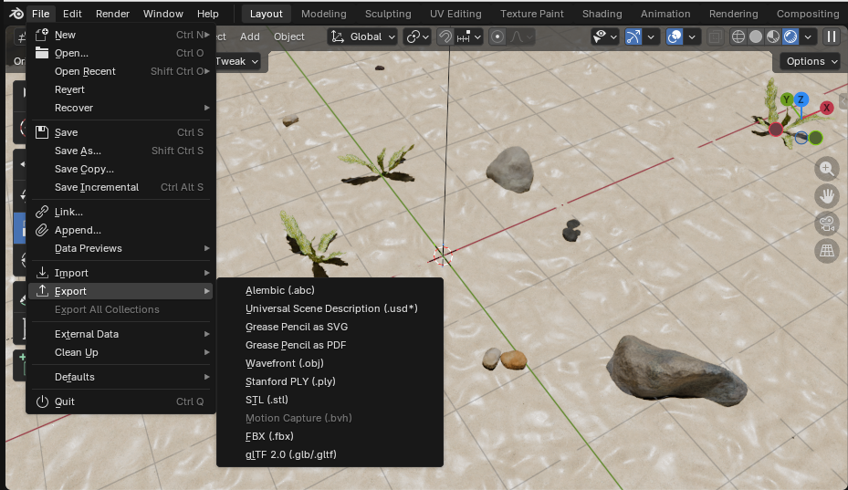

# TUTORIAL

## Importing Objects into Blender

### Aim
This tutorial explains how to import objects into Blender and provides sources for finding such objects. 

### Background
To design an underwater scene with a realistic seafloor environment and objects of interest for imaging, objects should be imported from third-party sources. This faster and better quality than making things yourself.

### Initial Configuration

The scene is organised into the following collections:

| Collection         | Description                                                             |
|--------------------|-------------------------------------------------------------------------|
| Sand Seafloors     | Colour and texture for sand seafloor plane                              |
| Background Objects | Realistic seafloor objects in background e.g. rocks, seaweed, shipwreck |
| Everyday Objects   | Objects of interest in foreground and randomly positioned               |

This setup is followed in the .blend file and in the blender_files/ folder. 

### Third-Party Sites

<!-- REPLACE WITH TABLE

#### Sand Seafloor

The sand seafloor material was sourced from: https://ambientcg.com/view?id=Ground054. This is a very good resource for many other materials and environments.  

#### Background Objects

For background objects

two ebsites, put in example objects

#### Everyday Objects

Can find on websites, but for easy access, large dataset, used for current tabletop datasets so interested in submerging the objects
ShapeNet
Say how need to make account and go through 2 layers of approval and need a Hugging face account, so will take a 2-3 days before can start using 

shapenet: https://shapenet.org/
shapenet categories: https://shapenet.org/taxonomy-viewer 
number -- category translator: https://shapenet.org/resources/data/shapenetcore.taxonomy.json  -->

### Instructions

Use .obj as an example

This is for .obj, but all those options possible. 

Mention needing textures and colours, important for realism, light scattering

Download 

then navigate to where .obj file is stored

e.g. 

### Debugging Tips

Whenever Blender renders it prints the output file's location to the terminal that opened Blender. 

Run render_animation.py (with scene.frame_end = 1) or render_image.py to test rendering a single frame. Then check the terminal where the script ran to read directly where renders are outputted to. 

### FAQs

#### *Why use a delete_global folder?*

improvements: randomising selected objects and their positioning 
- currently have gone through and manually chosen objects, then left them in the everyday objects collection 
- could instead import objects in the python script from their download after shapenet