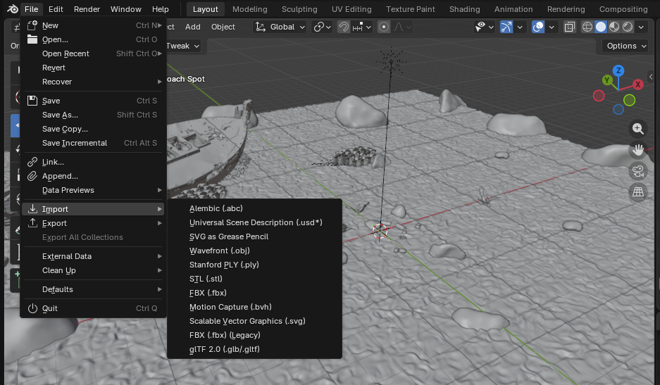

# TUTORIAL

## Importing Objects into Blender

### Aim
This tutorial explains how to import objects into Blender and provides sources for finding such objects. 

### Background
To create an underwater scene with a realistic seafloor environment and objects of interest for imaging, objects should be imported from third-party sources. This is fast and produces a high quality scene.

### Initial Configuration

The scene is organised into the following collections:

| Collection         | Description                                                             |
|--------------------|-------------------------------------------------------------------------|
| Sand Seafloors     | Sand seafloor plane                                                     |
| Background Objects | Seafloor objects in background e.g. rocks, seaweed, shipwreck           |
| Everyday Objects   | Objects of interest in foreground and randomly positioned               |

This setup is followed in the .blend file and in the blender/ folder. 

### Third-Party Sites

| Website | Description | Use in Underwater Scene |
|--------|-------------|-------------------------|
| [Ambient](https://ambientcg.com/view?id=Ground054) | Surface textures and materials    Link leads to the sand texture used | Sand Seafloors |
| [ShapeNet](https://shapenet.org/)  Categories listed [here](https://shapenet.org/taxonomy-viewer)  Categories in Hugging Face organised by WordNet numbers, convert numbers to categories [here](https://shapenet.org/resources/data/shapenetcore.taxonomy.json) | Dataset of objects, all with `.obj` and materials (e.g. couches, chairs, bins)  Has been used for tabletop grasping datasets in other research  Make an account then download via Hugging Face — two layers of approval: ShapeNet account, then Hugging Face access | Everyday Objects  |
| Sketchfab: - [Smithsonian Museum objects](https://sketchfab.com/Smithsonian) -[Coral](https://sketchfab.com/3d-models/thin-leaf-lettuce-coral-agaricia-tenufolia-bb8f65f9b13d4070b173f813b7dbe6bc) -[Fish](https://sketchfab.com/3d-models/animated-swimming-tropical-fish-school-loop-62ccf83b35c744d7b5ffb7be80d4ea99#download) -[Fish](https://sketchfab.com/3d-models/school-of-fish-91eb21198a274974a1fae477d14fe52c) -[Shark](https://sketchfab.com/3d-models/swimming-shark-70b107e982d44869839197124c1728b0) -[Plane wreck](https://sketchfab.com/3d-models/japanese-zero-plane-wreck-8848c1c371a643aa95246927107ce7d3) - [Seaweed](https://sketchfab.com/3d-models/seaweed-dec5b256a37f40acb63b0bf30b45d756) -[Shipwreck](https://sketchfab.com/3d-models/wooden-boat-wreck-500k-595934a89fb04653932eebcdabb78cc7) | Free public models. Browse through for desired objects | Background Objects |
| cgtrader: - [Seaweed](https://www.cgtrader.com/free-3d-models/plant/other/seaweed-6c855842-c6ff-4078-86d3-f521d78f445b) - [Rocks](https://www.cgtrader.com/free-3d-models/exterior/landscape/river-rocks) | Free public models. Browse through for desired objects | Background Objects |

### Instructions

First download the desired object from the sources provided above or from your own research. Make sure the object comes with files to describe its material e.g. normals, colour. The ShapeNet everyday objects are .obj files and come with the material files. 

To keep things organised, move the download into the blender/ folder, then the particular subcategory e.g. Everyday Objects.

After downloading, the object can be imported from the File menu, as shown below.

Position and scale (to re-size) the object as needed. 

To move the object into a collection in the Outliner (top right panel), select the object, press 'M', then select the collection.

Also, sometimes the faces of the ShapeNet objects are jagged and zebra pattern-like. Right click the object and 'Auto-Smooth' it. 

