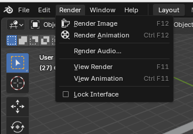

# TUTORIAL

## Render a Single Animation or Frame

### Aim
This tutorial explains how to render a single frame or animation of the Blender scene as it is, from a Python script running it in the background. 


### Background
It is sometimes useful to render the scene as it is when editing in the Blender GUI to see what the final render will look like.

Rendering a single frame outputs 4 files - 2 raw RGB and 2 raw depth, each for the left and right cameras. 

Rendering an animation does a series of single frames for the number of frames inputted. This is useful for checking the camera path is correct. 

The scripts `render_image.py` and `render_animation.py` are found in `scripts/misc/`.


### Instructions

#### Render Single Frame

##### Rendering from `render_image.py`

Render a single image of the Blender scene as currently saved/configured. Run the following command from the root of the repo: 

```
blender -b blender_scene/underwater_scene.blend --python scripts/blender/render_image.py
```

You should find the output renders in `results/blender_output/temp`.


##### Rendering from `render_animation.py`

The animation script can be edited to render just a single frame by making the start and end frames equal ie animation goes for one frame. Set the `scene.frame_start` and `scene.frame_end` variables as desired e.g. both to 1. 

Run the following command from the root of the repo: 

```
blender -b blender_scene/underwater_scene.blend --python scripts/blender/render_animation.py
```
You should find the output renders in `results/blender_output/temp`.

##### Rendering in Blender

Can also be done in the Blender GUI from the Render tab (see photo) or by pressing F12. This will not run in the background and slow down working in the GUI, so it is not recommended for long renders. 



#### Render Animation

##### Rendering from `render_animation.py`

Set the `scene.frame_start` and `scene.frame_end` variables as desired e.g. to 1 and 30 for 30 frames. 

Run the following command from the root of the repo: 

```
blender -b blender_scene/underwater_scene.blend --python scripts/blender/render_animation.py
```
You should find the output renders in `results/blender_output/temp`.

##### Rendering in Blender
Again achieved in the Blender GUI from the Render tab.